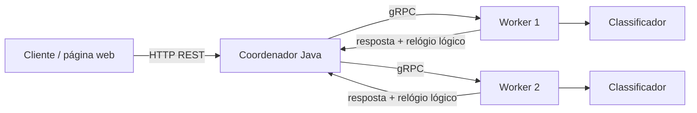

# Classificação Distribuída de Resíduos

Projeto do **Trabalho Prático de Computação Distribuída** da PUC Minas.

A proposta é usar classificação de imagens de resíduos como o problema computacional do sistema distribuído. Um coordenador recebe uma ou várias imagens, divide o trabalho entre nós trabalhadores e reúne as respostas. O foco desta disciplina não é treinar o melhor modelo de visão computacional possível, mas estudar de forma prática comunicação entre nós, RPC, relógios lógicos, paralelismo, falhas de comunicação e desempenho distribuído.

## Requisitos da primeira entrega atendidos

O enunciado pede pelo menos dois requisitos entre RPC, sincronização de relógios, eleição de líder, exclusão mútua distribuída e web services. Esta base implementa três:

- **RPC com gRPC** entre o coordenador e os workers;
- **Relógio lógico de Lamport** implementado no coordenador e nos workers;
- **Web Service REST** no coordenador para receber as requisições externas.

Também existe um tratamento básico de falha de comunicação: cada chamada gRPC tem timeout e, se um worker não responder, o coordenador tenta outro worker disponível.

## Arquitetura



O coordenador é responsável por receber o lote, escolher os workers, enviar as chamadas em paralelo, aplicar timeout/failover, atualizar o relógio lógico e agregar o resultado final.

Cada worker é um processo independente. Ele recebe uma imagem por gRPC, atualiza seu relógio lógico de Lamport, executa a classificação e devolve a classe, a confiança, o identificador do worker, o tempo de processamento e o novo valor do relógio.

## Estrutura

```text
.
├── coordinator/        # serviço coordenador em Java + Spring Boot
├── worker/             # nó trabalhador em Python + gRPC
├── docs/               # documentação da arquitetura e da entrega
├── scripts/            # pequenos scripts de teste
├── docker-compose.yml  # ambiente local com coordenador + 2 workers
└── README.md
```

## Tecnologias

- Java 17
- Spring Boot
- gRPC + Protocol Buffers
- Python 3.11
- PyTorch/Torchvision para o classificador
- Docker e Docker Compose

## O que é "web service" aqui?

Não é obrigatório ter uma página web para cumprir o requisito. O **Web Service** é a API HTTP oferecida pelo coordenador.

Mesmo assim, este projeto inclui uma página HTML simples em `http://localhost:8080/` para facilitar a demonstração. Ela é apenas um cliente visual da API.

A comunicação interna coordenador → workers não usa REST. Ela usa **gRPC**, que é justamente um dos requisitos escolhidos para o trabalho.

## Execução mais simples

Pré-requisito:

- Docker
- Docker Compose

Na raiz do projeto:

```bash
docker compose up --build
```

Serviços:

- Coordenador/API: `http://localhost:8080`
- Worker 1 gRPC: `localhost:50051`
- Worker 2 gRPC: `localhost:50052`

Abra no navegador:

```text
http://localhost:8080/
```

Ou teste a API:

```bash
curl http://localhost:8080/api/health
```

```bash
curl http://localhost:8080/api/workers
```

Para classificar imagens:

```bash
curl -X POST http://localhost:8080/api/classify \
  -F "files=@foto1.jpg" \
  -F "files=@foto2.jpg"
```

## Modo de demonstração

O repositório não inclui um modelo treinado. Isso é proposital.

Sem um arquivo de modelo, o worker entra em **modo DEMO**. Nesse modo, ele continua exercitando toda a parte distribuída — REST, gRPC, divisão entre workers, relógios de Lamport, timeout e agregação — mas a classe retornada é apenas determinística para permitir testes de infraestrutura e vem marcada como `demoMode: true`.

Para uma apresentação final, basta colocar um checkpoint compatível em:

```text
worker/models/waste_mobilenet_v3_small.pt
```

O worker tenta carregar uma MobileNetV3 Small com seis classes:

```text
battery, glass, metal, organic, paper, plastic
```

## Relógio lógico de Lamport

Cada processo mantém um contador lógico.

Ao enviar uma mensagem:

```text
clock = clock + 1
```

Ao receber uma mensagem com timestamp `T`:

```text
clock = max(clock, T) + 1
```

O timestamp acompanha as mensagens gRPC. Assim é possível observar a ordenação lógica dos eventos sem depender da hora física dos computadores.

Exemplo simplificado:

```text
Coordenador: relógio 4
   |
   | envia request com t=5
   v
Worker: estava em 2
Worker: max(2,5)+1 = 6
Worker processa
Worker envia resposta com t=7
   |
   v
Coordenador: max(5,7)+1 = 8
```

## Executando em máquinas diferentes

O `docker-compose.yml` é ótimo para desenvolvimento local, mas dois containers no mesmo computador ainda compartilham o mesmo hardware físico.

Para um experimento distribuído mais convincente, execute cada worker em uma máquina diferente.

Exemplo:

```text
PC A: coordenador       192.168.0.10
PC B: worker-1          192.168.0.11:50051
PC C: worker-2          192.168.0.12:50051
```

Nos computadores dos workers:

```bash
docker build -t cd-waste-worker ./worker
docker run --rm \
  -p 50051:50051 \
  -e WORKER_ID=worker-1 \
  cd-waste-worker
```

No computador do coordenador:

```bash
docker build -t cd-waste-coordinator ./coordinator
docker run --rm \
  -p 8080:8080 \
  -e WORKER_ADDRESSES=192.168.0.11:50051,192.168.0.12:50051 \
  cd-waste-coordinator
```

As máquinas precisam conseguir alcançar umas às outras pela rede. Uma LAN é a opção mais simples para os experimentos, mas tecnicamente também seria possível usar máquinas em redes diferentes por meio de roteamento público ou VPN.

## Endpoints

### `GET /api/health`

Mostra o estado do coordenador e seu relógio lógico.

### `GET /api/workers`

Consulta os workers configurados e informa quais responderam.

### `POST /api/classify`

Recebe uma ou mais imagens usando `multipart/form-data`.

Campo:

```text
files
```

Exemplo de resposta:

```json
{
  "requestId": "3de4...",
  "totalImages": 2,
  "totalTimeMs": 91,
  "coordinatorLogicalTime": 12,
  "results": [
    {
      "filename": "foto1.jpg",
      "label": "plastic",
      "confidence": 0.72,
      "workerId": "worker-1",
      "status": "DEMO",
      "workerLogicalTime": 6,
      "processingTimeMs": 8,
      "demoMode": true
    }
  ]
}
```

## Falha de um worker

Com o ambiente rodando, pare um worker:

```bash
docker compose stop worker-1
```

Depois envie várias imagens novamente.

O coordenador usa deadline nas chamadas gRPC. Se o worker escolhido falhar, ele tenta outro nó antes de retornar erro para aquela imagem.

Isso serve como base para a segunda entrega, em que o tratamento de falhas deverá ser aprofundado e documentado.

## Arquivos importantes

- [`docs/arquitetura.md`](docs/arquitetura.md): detalha quem se comunica com quem.
- [`docs/requisitos-entrega-1.md`](docs/requisitos-entrega-1.md): relaciona a implementação com o enunciado.
- [`docs/roteiro-relatorio-entrega-1.md`](docs/roteiro-relatorio-entrega-1.md): guia para o relatório SBC.
- [`coordinator/src/main/proto/classifier.proto`](coordinator/src/main/proto/classifier.proto): contrato gRPC.
- [`worker/proto/classifier.proto`](worker/proto/classifier.proto): mesmo contrato usado pelo worker.

## Observações

O sistema foi deixado propositalmente simples o suficiente para ser estudado pelo grupo. Antes da apresentação, é importante que todos saibam explicar:

1. por que existe um coordenador;
2. como os workers são escolhidos;
3. diferença entre REST e gRPC;
4. como funciona o relógio de Lamport;
5. o que acontece quando um worker não responde;
6. por que containers locais ajudam no desenvolvimento, mas não equivalem a vários computadores físicos.

A arquitetura ainda pode ser alterada conforme as orientações do professor.
